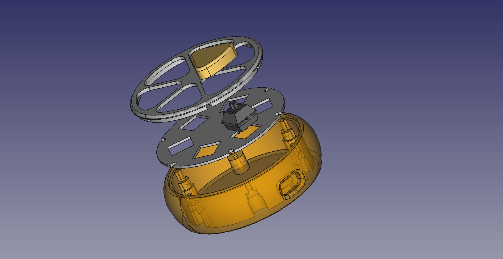

## Shell CAD

The design is remixed from the original adafruit version. What reused are:

- key switch layout
- key cap

What modified/redesigned are:

- main body
    - make it a one-piece object for easier 3D printing and assembling
    - adapt to custom PCB shape
- plates

*WARNING: If you want to replicate my work, use the STL models(tested), NOT the FreeCAD file! They may not synchronized!*

## Assembly notes

- The PCB is mounted with one optional M3 screw.
- The switch plate is secured by those MX switches.
- The top plate is secured through interference fit.

## 3D view

