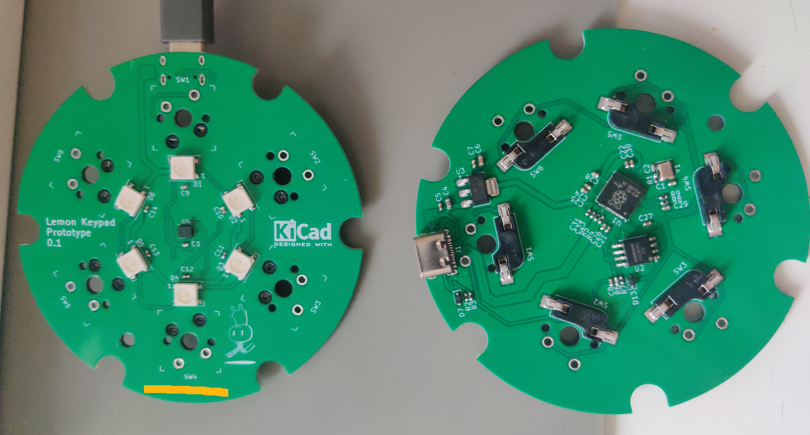
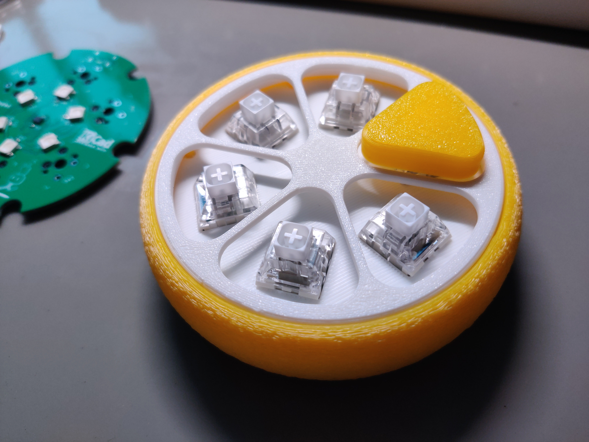

# Lemon Keypad

> [English](README.md), [简体中文](README.zh.md)

A macro pad/mechanical keyboard based on RP2040. This is *probably* an *improved* version of the [original adafruit version](https://learn.adafruit.com/qtpy-lemon-mechanical-keypad-macropad/).

This is a simple 6-key keypad. What makes it different is that the main program is written in async Python(CircuitPython).
With python's flexibility, a lot can be done with ease with this keypad, on demand.

<!-- TOC depthfrom:2 -->

- [Project folders and their content](#project-folders-and-their-content)
- [Software implementation](#software-implementation)
    - [implemented](#implemented)
    - [potentials left to users](#potentials-left-to-users)
- [Hardware components](#hardware-components)
- [The real thing: close looks](#the-real-thing-close-looks)

<!-- /TOC -->

This repo consists of shell CAD(FreeCAD & STL), PCB design files(KiCAD), and software(CircuitPython project).

I found myself lack the capability/motivation to productize it, so I decided to publish it and hope it last longer, inspiring others.

## Project folders and their content

- CAD: stores CAD files for shell
- lemon-rp2040-keypad: kicad project file
- software: CircuitPython project directory

## Software implementation

### implemented

- keyboard keys input
    - including consumer control keys
- mouse input
- complex key actions
    - key combinations
    - key sequences
    - tap dance
    - layer switch
    - delay
- custom function
    - gyro mouse(built-in example)
    - level gauge(built-in example)

### potentials left to users

- random number generator
- Whack-a-Mole
- a BIG button used up-side-down
- password storage(with pin protection)
- ducky pad
- etc.

## Hardware components

- RP2040
- LSM6DS3TRC inertial module(gyro & accelerometer)
- WS2812 * 6
- MX switch hot-swappable socket
- Kailh BOX white switches
- WB25Q128JVSQ flash memory
- AMS1117-3V3
- misc passive components

## The real thing: close looks

