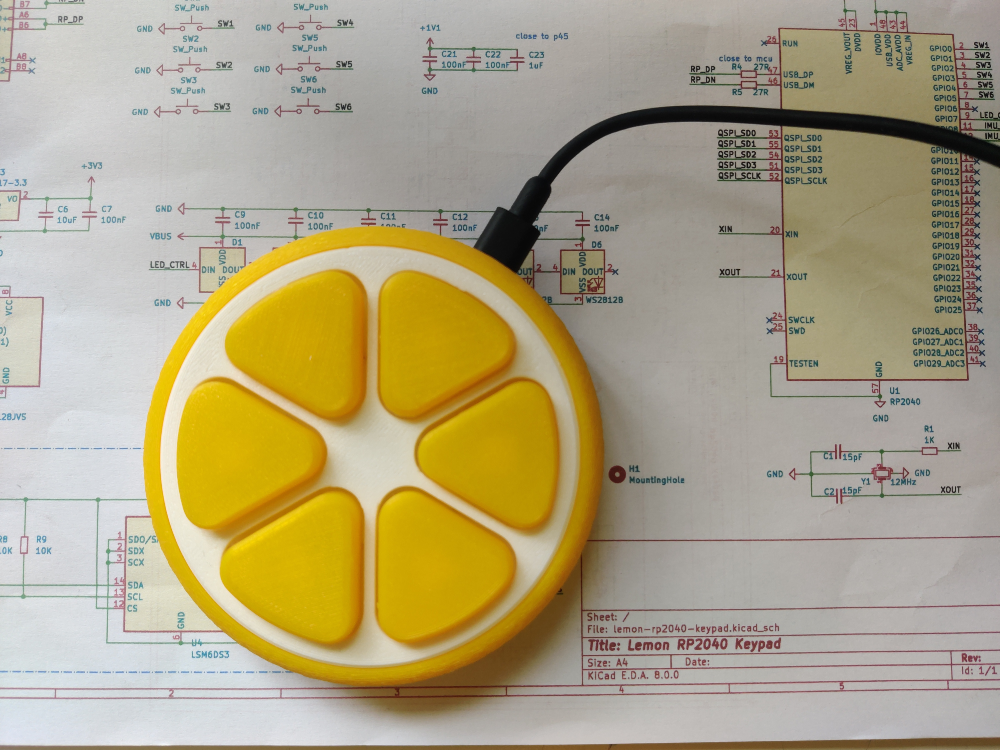
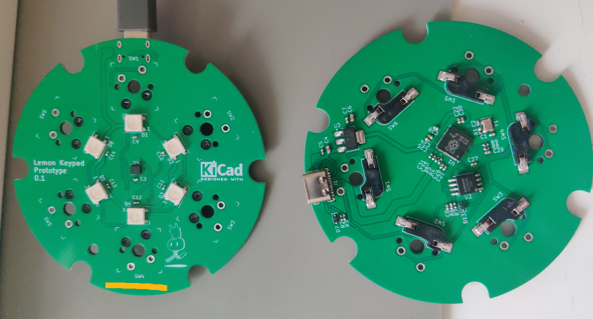
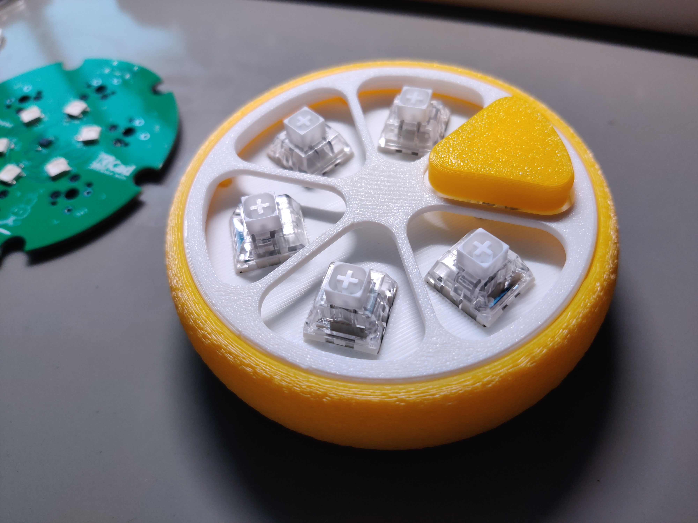

# 柠檬键盘

> [English](README.md), [简体中文](README.zh.md)

一个用RP2040制作的宏键盘。这可能是[Adafruit原版](https://learn.adafruit.com/qtpy-lemon-mechanical-keypad-macropad/)的改良版.

柠檬键盘是一个6键小键盘。它使用异步python编程，固件为CircuitPython。用Python的话，可以灵活实现很多有趣的功能。

<!-- TOC depthfrom:2 -->

- [项目文件夹目录结构](#%E9%A1%B9%E7%9B%AE%E6%96%87%E4%BB%B6%E5%A4%B9%E7%9B%AE%E5%BD%95%E7%BB%93%E6%9E%84)
- [软件实现概况](#%E8%BD%AF%E4%BB%B6%E5%AE%9E%E7%8E%B0%E6%A6%82%E5%86%B5)
    - [已实现](#%E5%B7%B2%E5%AE%9E%E7%8E%B0)
    - [供用户自行实现的潜能](#%E4%BE%9B%E7%94%A8%E6%88%B7%E8%87%AA%E8%A1%8C%E5%AE%9E%E7%8E%B0%E7%9A%84%E6%BD%9C%E8%83%BD)
- [硬件配置](#%E7%A1%AC%E4%BB%B6%E9%85%8D%E7%BD%AE)
- [实物近照](#%E5%AE%9E%E7%89%A9%E8%BF%91%E7%85%A7)

<!-- /TOC -->

这个仓库存放了外壳CAD文件（FreeCAD & STL）、PCB设计文件（KiCAD）以及键盘主程序（一个CircuitPython项目）。

做了些样品后，我感觉光靠自己搞不定/没什么动力量产，于是选择把项目公开，希望能启发更多人。

## 项目文件夹目录结构

- CAD：外壳模型文件
- lemon-rp2040-keypad：KiCAD项目，定制的电路板
- software：CircuitPython项目文件夹

## 软件实现概况

### 已实现

- 键盘输入
- 鼠标输入
- 复杂按键功能
    - 按键组合
    - 按键序列
    - 多功能连击
    - 层切换
    - 时延
- 自定义函数
    - 体感鼠标/飞鼠（内置的案例程序）
    - 水平仪（内置的案例程序）

### 供用户自行实现的潜能

- 随机数生成器
- 打地鼠
- 反过来当大号按钮
- 密码库（有PIN保护）
- 橡皮鸭/ducky
- 诸如此类……

## 硬件配置

- RP2040
- LSM6DS3TRC运动传感器（陀螺仪和加速计）
- WS2812灯珠6颗
- MX机械键盘轴热插拔底座
- 凯华BOX白轴
- WB25Q128JVSQ 16MB Flash存储器
- AMS1117-3V3 LDO
- 其它各种被动器件

## 实物近照

